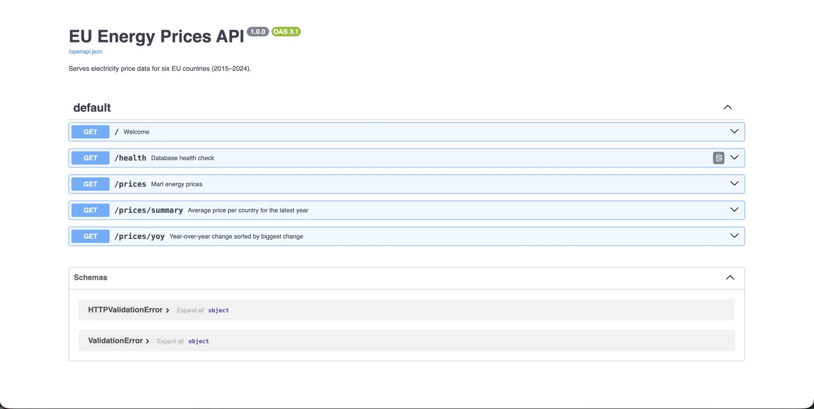

# EU Energy Intelligence Pipeline

An automated end-to-end data pipeline that tracks electricity prices across 6 EU countries, transforms them into analytics-ready datasets, and serves them via a REST API.

Built to explore a real problem: **EU electricity prices have been highly volatile since 2021**, driven by gas supply disruptions and the energy transition. This pipeline ingests official EU data, cleans it, tests it, and makes it queryable — daily, automatically.

---

## Architecture

```
Eurostat API
     │
     ▼
Python ingestion (fetch_eurostat.py)
     │
     ▼
DuckDB (raw layer)
     │
     ▼
dbt staging + mart models  ──►  15 data quality tests
     │
     ▼
PostgreSQL (serving layer)
     │
     ├──► FastAPI (REST endpoints)
     └──► pgAdmin / SQL (ad-hoc querying)

Orchestrated end-to-end via Python runner, scheduled daily via cron.
```

---

## Tech Stack

`Python` · `dbt` · `DuckDB` · `PostgreSQL` · `FastAPI` · `REST APIs` · `Cron` · `Git`

---

## What It Does

- **Ingests** electricity price data for Germany, France, Netherlands, Spain, Poland and Italy from the Eurostat API (2015–2024)
- **Transforms** raw data through dbt staging and mart models — cleaning, filtering, and adding business logic (YoY change, price categorisation)
- **Tests** data quality with 15 dbt tests covering nulls, accepted values, and range checks
- **Serves** the data two ways: a PostgreSQL database for direct querying, and a FastAPI layer for programmatic access
- **Monitors** itself with an automated daily data quality report (row counts, anomaly detection, YoY highlights)
- **Runs unattended** via a 6-step orchestrated pipeline, scheduled daily with cron

---

## API Preview

The FastAPI layer auto-generates interactive documentation for every endpoint:



| Endpoint | Description |
|---|---|
| `GET /health` | Database connection status + row counts |
| `GET /prices` | Mart data, filterable by country / year / consumer type |
| `GET /prices/summary` | Average price per country, latest year |
| `GET /prices/yoy` | Year-over-year price change, sorted by biggest movers |

---

## Running It Locally

**Prerequisites** — the pipeline connects to these but doesn't create them, so set up first:
- PostgreSQL running locally on port 5433, with a database called `eu_energy` and schema `energy_data`
- A free ENTSO-E API token, saved in a `.env` file as `ENTSOE_API_KEY=your_token`

```bash
# 1. Clone the repo
git clone https://github.com/rahul1078/eu-energy-pipeline.git
cd eu-energy-pipeline

# 2. Install dependencies
pip install -r requirements.txt
pip install -r requirements_api.txt

# 3. Run the full pipeline (ingestion → dbt → tests → Postgres → quality report)
python3 pipeline/run_pipeline.py

# 4. Start the API
uvicorn api.main:app --reload
# Visit http://127.0.0.1:8000/docs
```

---

## What I'd Add With More Time

This was built as a learning project to go deep on the fundamentals before adding complexity. Natural next steps:

- Replace cron with **Apache Airflow** for proper DAG-based orchestration and retries
- Move DuckDB to a cloud warehouse (Snowflake / BigQuery) for scale
- Add **ENTSO-E** hourly price data for higher resolution analysis
- Containerise with **Docker** and add CI/CD via GitHub Actions

---

*Built by Rahul Aswani —  [GitHub](https://github.com/rahul1078)*